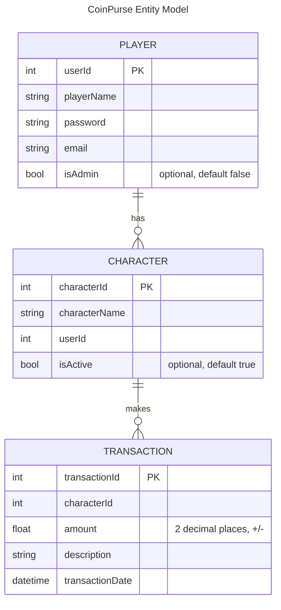

```mermaid
---
title: CoinPurse Entity Model
---
erDiagram
    PLAYER ||--o{ CHARACTER : has
    CHARACTER ||--o{ TRANSACTION : makes

    PLAYER {
        int userId PK
        string playerName
        string password
        string email
        bool isAdmin "optional, default false"
    }

    CHARACTER {
        int characterId PK
        string characterName
        int userId
        bool isActive "optional, default true"
    }

    TRANSACTION {
        int transactionId PK
        int characterId
        float amount "2 decimal places, +/-"
        string description
        datetime transactionDate
    }


```
